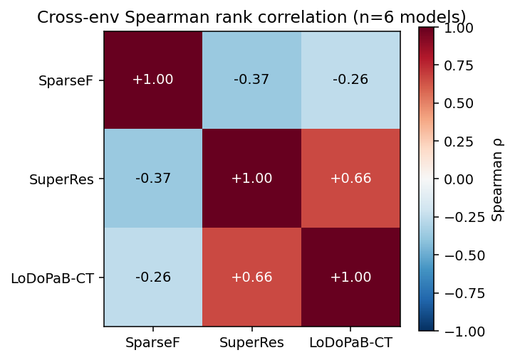

# verifiable-labs-envs

Reinforcement-learning environments for scientific reasoning — physics-grounded inverse problems with uncertainty-calibrated rewards.

> **Status (2026-04-26):** Day 4 of an 11-day sprint. All three planned environments shipped: `sparse-fourier-recovery` (1D compressed sensing), `super-resolution-div2k-x4` (2D 4x SR with bicubic baseline), and `lodopab-ct-simplified` (2D parallel-beam CT with FBP baseline). 79 tests green, full suite under 1 s.

## What this is

Frontier reasoning models are trained with verifiable rewards (RLVR). Today's RL environments are mostly text-only, saturate quickly, and miss the continuous, ill-posed reasoning that real science requires. This package provides environments where:

1. The **forward operator** is exact and JIT-compiled (JAX), so a model must actually invert physics.
2. The **reward** is a weighted sum of reconstruction quality (PSNR, SSIM, or task-appropriate metric) and **conformal-prediction coverage** — models are rewarded for honest posterior width, not overconfident point estimates.
3. Measurements are **procedurally regenerated per evaluation call**, so fixed-string memorization is structurally impossible.

## Environments (v0.0.1)

| # | Environment | Status | Forward operator | Baseline |
|---|---|---|---|---|
| 1 | `sparse-fourier-recovery` | ✅ | subsampled orthonormal 1D DFT | OMP with LS-covariance σ̂ |
| 2 | `super-resolution-div2k-x4` | ✅ | Gaussian blur + 4× decimation | bicubic with edge-weighted σ̂ |
| 3 | `lodopab-ct-simplified` | ✅ | 2D parallel-beam Radon (60-angle) | FBP with edge-weighted σ̂ (phantom default; real-patient LoDoPaB-CT slices via `use_real_data=True`) |

## Classical-baseline benchmark (5 seeds each, default hyperparameters)

| environment | reference reward | zero reward | gap | conformal q |
|---|---:|---:|---:|---:|
| `lodopab-ct-simplified` | 0.712 | 0.151 | +0.561 | 0.241 |
| `sparse-fourier-recovery` | 0.869 | 0.336 | +0.533 | 1.587 |
| `super-resolution-div2k-x4` | 0.629 | 0.425 | +0.203 | 2.167 |

Reproduce with `python benchmarks/run_all.py --seeds 5`.

## Real-data CT (LoDoPaB-CT validation, opt-in via `use_real_data=True`)

Phase 2 adds a real-patient-geometry path on `lodopab-ct-simplified`: 3552 validation slices from the LoDoPaB-CT dataset (Leuschner et al. 2021, Nature Scientific Data) drawn from the LIDC-IDRI clinical chest-CT cohort. CI defaults stay on the phantom rotation so no download is required. One-shot activation:

```bash
bash scripts/download_lodopab_validation.sh      # ~1.5 GB zip, 28 HDF5 chunks
python -c "from verifiable_labs_envs.envs import lodopab_ct as ct; print(ct.load_environment(use_real_data=True).run_baseline(seed=0))"
```

Spot-check numbers (this repo, Apr 2026):

| Solver | Mode | Mean reward | Notes |
|---|---|---:|---|
| Classical FBP | phantom (5 seeds) | 0.712 | Sprint 0 baseline |
| Classical FBP | **real (10 seeds)** | **0.731** | mean PSNR 0.62, SSIM 0.64 — real CT is structurally cleaner than the synthetic phantoms |
| Claude Haiku 4.5 | phantom (5 seeds) | 0.615 | Sprint 0 0/5 parse-fail |
| Claude Haiku 4.5 | **real (3 seeds)** | 0.694 on 1/3 success | 2/3 parse-fails — "expected 32 entries, got 31" on seeds 0 and 2. Real CT grids are harder for the model to transcribe without losing count than the phantom pattern. |

Raw data: [`results/ct_real_spotcheck.csv`](results/ct_real_spotcheck.csv).

## LLM benchmark (OpenRouter, 5 seeds each, total spend $1.89)

| Model | SparseFourier | SuperRes | LoDoPaB-CT | Mean (3 envs) |
|---|---:|---:|---:|---:|
| **Reference baseline (OMP / bicubic / FBP)** | **0.869** | **0.629** | **0.712** | **0.737** |
| Claude Opus 4.7 | 0.300 | 0.628 | 0.625 | 0.518 |
| Claude Sonnet 4.6 | 0.316 | 0.629 | 0.595 | 0.513 |
| **Claude Haiku 4.5** | 0.361 | 0.625 | 0.615 | **0.534** |
| GPT-5.4 | 0.311 | 0.601 | 0.571 | 0.494 |
| GPT-5.4 mini | 0.340 | 0.464 *(1/5 fail)* | 0.578 *(1/5 fail)* | 0.460 |
| GPT-5.4 nano | 0.350 | 0.528 *(2/6 fail)* | 0.197 *(4/6 fail)* | 0.358 |
| Zero baseline | 0.336 | 0.425 | 0.151 | 0.304 |

Clean discrimination across model tiers and clean rank-ordering against the expert classical baselines. The environments measure capability, not chance:

- **Classical expert algorithms (mean 0.737) beat every general-purpose LLM** on these inverse problems.
- **Sparse-Fourier is a weak LLM discriminator** (all models 0.30–0.36, barely above zero baseline 0.336) — compressed sensing is not yet a text-completion task.
- **Super-resolution and CT produce a useful ranking** (Haiku / Sonnet / Opus / GPT-5.4 cluster at ~0.60, small models drop off).
- **JSON-count parse-failure rate scales inversely with model size**: `gpt-5.4-nano` fails 33% of grid outputs, `gpt-5.4-mini` 11%, everything Haiku-and-above 0% — a legitimate discrimination axis on its own.
- **Cross-env correlation matrix** (Spearman, n=6 models): SuperRes ↔ CT = +0.66 (same structural task); SparseF ↔ image envs = −0.26 to −0.37 (different capabilities). The three envs measure different things. Full methodology in [`docs/METHODOLOGY.md`](docs/METHODOLOGY.md); heatmap in [`results/env_correlation_heatmap.png`](results/env_correlation_heatmap.png).



Reproduce with `python benchmarks/run_llm_benchmark.py --preset paid-full`. See [`results/llm_benchmark.md`](results/llm_benchmark.md) for the full analysis and [`results/llm_benchmark.csv`](results/llm_benchmark.csv) for per-call raw data.

## Install (once Day 1 is done)

```bash
git clone https://github.com/verifiable-labs/envs
cd envs
python -m venv .venv && source .venv/bin/activate
pip install -e ".[dev]"
pytest
```

## Quickstart

```python
from verifiable_labs_envs import load_environment

env = load_environment("sparse-fourier-recovery")
result = env.run_baseline(seed=0)
print(result["reward"])            # e.g. 0.931
print(result["components"])        # {"nmse": 0.977, "support": 0.900, "conformal": 0.900}
print(result["meta"]["coverage"])  # 0.80 — fraction of support entries inside the conformal interval
```

Any custom solver can be scored by returning a `Prediction(x_hat, sigma_hat, support_hat=...)`
and passing it to `env.score(prediction, instance)`.

Walkthrough across all three environments:

```bash
python examples/quickstart.py
```

## Contamination resistance

Every environment in this repo is structurally resistant to the three attacks that have hollowed out static text benchmarks: train-set leakage, answer-string matching, and distribution creep. Full analysis in [`docs/CONTAMINATION.md`](docs/CONTAMINATION.md). Headline numbers:

- `sparse-fourier-recovery` — the per-instance state space is continuous (10 real-valued amplitudes + 128 real-valued complex-noise coordinates), on top of `C(256, 10) × C(256, 64) ≈ 10⁷³` combinatorial arrangements of support and mask.
- `super-resolution-div2k-x4` and `lodopab-ct-simplified` — the discrete image / phantom set is small (6 and 5 respectively, a known v0.0.1 weakness flagged in the doc), but measurement noise is regenerated per call so memorizing the HR image doesn't reproduce the measurement.
- An empirical memorization probe at [`scripts/memorization_probe.py`](scripts/memorization_probe.py) confirms: across Haiku 4.5, GPT-5.4 mini, and GPT-5.4 nano on `sparse-fourier-recovery`, all three models show cross-seed reward std ≥ 0.02 (no constant-output signatures). Raw data: [`results/memorization_probe.csv`](results/memorization_probe.csv).

## Documentation

- [`docs/conformal.md`](docs/conformal.md) — the conformal-coverage reward term: why it's there, how it's calibrated, what it rewards.
- [`docs/CONTAMINATION.md`](docs/CONTAMINATION.md) — contamination resistance analysis, per-env effective instance count, empirical probe methodology.
- [`docs/METHODOLOGY.md`](docs/METHODOLOGY.md) — benchmark aggregation, cross-env correlation interpretation, failure taxonomy.
- [`docs/env1_sparse_fourier_design.md`](docs/env1_sparse_fourier_design.md) — Env 1 architecture and reward specification.

## Author

Stelios Zacharioudakis — finishing BSc CS at the University of Athens (NKUA). Research on calibrated astronomical inverse imaging.

## License

Apache 2.0. See `LICENSE`.
